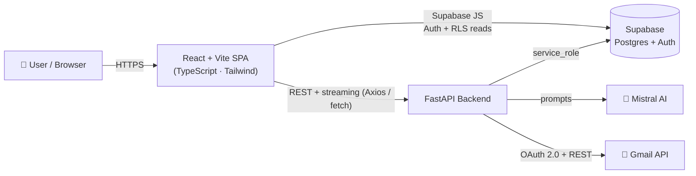
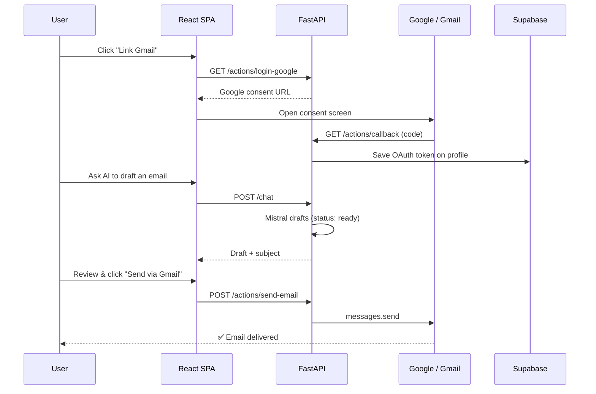

<div align="center">

# 📬 Smart Email Agent

### An AI email copilot that reads your inbox, drafts replies, and sends mail on your behalf — powered by Mistral AI and the Gmail API.

[](https://react.dev/)
[](https://vitejs.dev/)
[](https://www.typescriptlang.org/)
[](https://tailwindcss.com/)
[](https://fastapi.tiangolo.com/)
[](https://www.python.org/)
[](https://supabase.com/)
[](https://mistral.ai/)

</div>

---

## 📖 Overview

**Smart Email Agent** is a full-stack AI email assistant. It connects to your Gmail through OAuth, uses **Mistral AI** to understand and write emails, and streams agentic multi-step actions in real time — all behind a polished, glassmorphic React dashboard.

Every data surface is **real**: inbox summaries, analytics, contacts and notifications are computed live from the Gmail API, and drafts are personalised with your profile. The app deliberately **never auto-sends** — every AI draft is handed to a compose modal for a human "Review & Send".

> **Why it's interesting:** it combines OAuth-based Gmail integration, an LLM prompt layer with 15 writing tools and 13 reply styles, a streaming (NDJSON) agent loop, and real-time analytics — wired together with React Query caching and Supabase row-level security.

---

## ✨ Features

### 🤖 AI Writing & Assistance
- **Conversational workspace** — a chat assistant that drafts context-aware emails, with per-conversation memory and an auto-threaded history sidebar.
- **Smart Reply** — paste any received email and generate replies in up to **13 distinct styles** (professional, friendly, formal, negotiation, apology, sales, technical, persuasive, and more).
- **AI Tools suite** — **15 one-click tools** across three groups:
  - *Write & Edit:* Improve, Rewrite, Grammar Fix, Summarize, Translate
  - *Analyze & Protect:* Tone Detection, Spam Detection, Phishing Detection
  - *Generate:* Subject Lines, Follow-up, Cold Email, Cover Letter, LinkedIn Outreach, Interview Email
- **Live token streaming** — tool output renders progressively as the model generates it.

### 🧠 AI Agent Mode
- Natural-language commands ("summarise my inbox", "clean up promotions", "draft a reply to…") are classified into intents and executed as an **animated, streamed step trace**.
- Real tools: reads & summarises the inbox, archives promotional mail, drafts emails/replies/meeting invites.
- **Safety-first:** drafting intents return a draft for human review — the agent never sends on its own.

### 📥 Gmail Intelligence (all live data)
- **AI Inbox Summary** — a structured briefing (what's important, what needs a reply, spam vs. newsletters, action items, suggestions).
- **Inbox Center** — browse messages by real Gmail tabs (Primary, Social, Promotions, Updates, Forums, Important, Starred, Unread, Newsletters) with one-click **archive / trash / star / mark read / mark important** actions.
- **Analytics** — exact 30-day sent/received volume, a 7-day daily trend, category mix, top senders and lifetime mailbox totals.
- **Contacts** — the people you actually email, derived from your sent and received mail.
- **Notifications** — your latest unread messages, with a real "mark all read".

### 🔐 Account & Connection
- **Email/password auth** via Supabase (accounts are auto-confirmed for instant sign-in).
- **Gmail OAuth 2.0** linking with scope-aware capability display (send / read / modify), re-link and unlink.
- **Profile** and **Settings** pages showing live account facts, connection health and in-app password reset.

### 🎨 Experience
- Glassmorphic dark UI with Framer Motion transitions, animated counters and Recharts visualisations.
- Global **⌘K command palette** and a floating quick-action button.
- Guided onboarding, toast notifications and graceful empty / error / re-auth states throughout.

---

## 🏗️ Architecture



**How it fits together**
- The **React SPA** owns auth, the chat workspace and the compose modal (`App.jsx`), and routes all "workspace" views through `CopilotView.tsx`.
- It talks to **Supabase directly** for authentication and for reading the user's own rows (protected by row-level security), and to the **FastAPI backend** for everything that needs Gmail or the LLM.
- The **FastAPI backend** is organised as one router per domain. It builds a per-user Gmail client from the stored OAuth token, calls **Mistral AI** for all generative features, and uses the Supabase **service-role** key for privileged reads/writes.

### Example workflow — link Gmail & send an AI draft



---

## 🧰 Tech Stack

| Layer | Technologies |
|---|---|
| **Frontend** | React 18, Vite 5, TypeScript, Tailwind CSS 3, Framer Motion, TanStack React Query 5, Recharts 3, Axios, React Markdown + remark-gfm, sonner (toasts), lucide-react |
| **Backend** | FastAPI, Uvicorn, Python 3.10, Pydantic, python-multipart |
| **AI** | Mistral AI (`mistral-medium-latest`) via the official `mistralai` SDK |
| **Email** | Gmail API + Google OAuth 2.0 (`google-api-python-client`, `google-auth-oauthlib`) |
| **Data & Auth** | Supabase (PostgreSQL + Auth) with Row-Level Security |

---

## 📡 API Reference

Base URL: `http://localhost:8000` · all routes are prefixed with `/api/v1`.

| Method | Endpoint | Description |
|---|---|---|
| `POST` | `/auth/signup` | Create an email-confirmed account (Supabase admin API) |
| `POST` | `/chat/` | Conversational AI email assistant with per-thread memory |
| `GET`  | `/actions/login-google` | Return the Google OAuth consent URL |
| `GET`  | `/actions/callback` | OAuth callback — stores the Gmail token on the profile |
| `GET`  | `/actions/history` | The user's last 10 chat queries |
| `POST` | `/actions/send-email` | Send an email via Gmail (optional file attachment) |
| `POST` | `/reply/generate` | Smart Reply — multiple styles from a pasted email |
| `GET`  | `/inbox/summary` | AI structured inbox briefing + stats |
| `GET`  | `/inbox/messages` | List messages for a tab (Gmail categories/views) |
| `POST` | `/inbox/action` | Archive / trash / star / mark read / mark important |
| `POST` | `/ai/tool` | Run one of 15 AI writing tools |
| `POST` | `/ai/tool/stream` | Streaming (token-by-token) variant |
| `POST` | `/agent/run` | Streamed (NDJSON) multi-step agent execution |
| `GET`  | `/analytics/overview` | Live Gmail volume, trend, category mix, top senders |
| `GET`  | `/contacts/list` | Real contacts derived from Gmail |
| `GET`  | `/notifications/list` | Latest unread inbox messages |
| `POST` | `/notifications/read_all` | Mark messages read (remove UNREAD label) |

> Interactive API docs are available at `http://localhost:8000/docs` (FastAPI / Swagger UI) when the backend is running.

---

## 📂 Project Structure

```
Automated-Email-Ai/
├── backend/                        # FastAPI service
│   ├── app/
│   │   ├── api/v1/                  # One router per domain
│   │   │   ├── auth.py              # Email/password signup
│   │   │   ├── chat.py             # Conversational AI assistant
│   │   │   ├── actions.py          # Gmail OAuth + send email
│   │   │   ├── reply.py            # Smart Reply (multi-style)
│   │   │   ├── inbox.py            # Inbox summary, tabs & actions
│   │   │   ├── tools.py            # AI writing tools (+ streaming)
│   │   │   ├── agent.py            # Streaming agent mode
│   │   │   ├── analytics.py        # Gmail analytics
│   │   │   ├── contacts.py         # Contacts from Gmail
│   │   │   └── notifications.py     # Unread-mail notifications
│   │   ├── services/
│   │   │   ├── ai_service.py        # Mistral prompt logic (all AI features)
│   │   │   └── gmail_service.py     # Per-user Gmail API client builder
│   │   ├── db/supabase.py           # Supabase client + helpers
│   │   ├── models/chat.py           # Pydantic request models
│   │   └── main.py                  # App entry + router registration
│   ├── requirements.txt
│   └── runtime.txt
├── frontend/                        # React + Vite + TypeScript SPA
│   ├── src/
│   │   ├── App.jsx                  # Auth, chat workspace, compose modal, shell
│   │   ├── CopilotView.tsx          # Router for workspace views
│   │   ├── pages/                   # Dashboard, Analytics, Profile, Settings, …
│   │   ├── components/              # UI kit, charts, dashboard, inbox, reply, tools
│   │   ├── lib/                     # API client, React Query hooks, types, helpers
│   │   └── supabaseClient.js        # Supabase browser client
│   ├── package.json
│   └── tailwind.config.js
├── database/
│   ├── schema.sql                   # Tables, RLS policies, signup trigger
│   └── migrations/
│       └── 002_conversations.sql    # Conversation-thread support
└── README.md
```

---

## 🚀 Getting Started

### Prerequisites
- **Node.js** 18+
- **Python** 3.10+
- A **Supabase** project (PostgreSQL + Auth)
- A **Mistral AI** API key
- A **Google Cloud** OAuth 2.0 Web client (Gmail API enabled)

### 1. Database
In the Supabase **SQL Editor**, run:
1. `database/schema.sql` — creates the `profiles` and `chat_messages` tables, RLS policies, and the signup trigger.
2. `database/migrations/002_conversations.sql` — adds the `conversations` table and links messages to threads.

### 2. Backend

```bash
cd backend
python -m venv .venv
# Windows:
.venv\Scripts\activate
# macOS/Linux:
source .venv/bin/activate

pip install -r requirements.txt
```

Create `backend/.env`:

```env
SUPABASE_URL=https://<your-project>.supabase.co
SUPABASE_KEY=<your-service-role-key>
MISTRAL_API_KEY=<your-mistral-api-key>
# Optional (production alternative to credentials.json):
# GOOGLE_CREDENTIALS_JSON={"web":{ ... }}
```

Add your Google OAuth web-client file as `backend/credentials.json`, then run:

```bash
python -m uvicorn app.main:app --reload --port 8000
```

### 3. Frontend

```bash
cd frontend
npm install
npm run dev        # → http://localhost:5173
```

The frontend's Supabase project (URL + anon key) is configured in `frontend/src/supabaseClient.js`, and the backend base URL is the `API_URL` constant (`http://localhost:8000`).

### 4. Google OAuth setup
- **Authorized redirect URI:** `http://localhost:8000/api/v1/actions/callback`
- **Scopes:** `gmail.send`, `gmail.readonly`, `gmail.modify`
- Add your Google account as a **Test user** on the OAuth consent screen.

---

## ⚙️ Environment Variables

| Variable | Where | Purpose |
|---|---|---|
| `SUPABASE_URL` | `backend/.env` | Supabase project URL |
| `SUPABASE_KEY` | `backend/.env` | **Service-role** key (privileged server-side access) |
| `MISTRAL_API_KEY` | `backend/.env` | Mistral AI API key for all generative features |
| `GOOGLE_CREDENTIALS_JSON` | `backend/.env` *(optional)* | Google OAuth client JSON for production (alternative to `credentials.json`) |
| `credentials.json` | `backend/` | Google OAuth Web client for local development |

---

## 🗄️ Data Model

| Table | Key columns | Purpose |
|---|---|---|
| `profiles` | `id`, `full_name`, `signature`, `gmail_token`, `created_at` | One row per user; stores the Gmail OAuth token. Auto-created on signup via a trigger. |
| `conversations` | `id`, `user_id`, `title`, `updated_at` | Chat threads shown in the workspace sidebar. |
| `chat_messages` | `id`, `user_id`, `role`, `content`, `conversation_id` | Per-thread chat history (assistant memory). |

All tables are protected by **Row-Level Security** so users can only read and write their own rows.

---

## 🔒 Design Principles

- **Real data only** — every inbox, analytics, contacts and notifications surface is computed live from the Gmail API. There are no mock numbers.
- **Human-in-the-loop** — the AI drafts, the human sends. No email leaves without an explicit "Send" click.
- **Least-privilege reads** — the browser reads its own data through Supabase RLS; only the backend holds the service-role key and Gmail tokens.
- **Graceful degradation** — every Gmail-backed view has explicit loading, empty, error and "re-link required" states.

---

## 📝 License

No license file is currently included in this repository. Add one (e.g. MIT) if you intend to make the project open source.

---

<div align="center">

**Built with React, FastAPI, Supabase, the Gmail API, and Mistral AI.**

</div>
