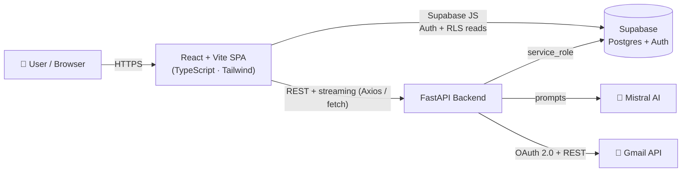
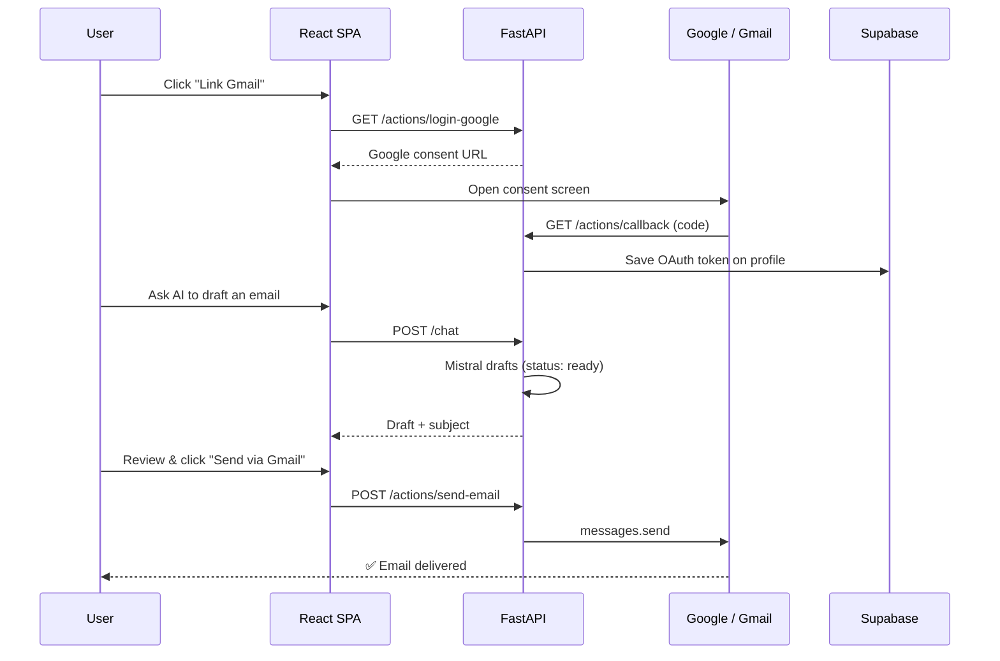

<div align="center">

# 📬 Smart Email Agent

### An AI email copilot that reads your inbox, drafts replies, and sends mail on your behalf — powered by Mistral AI and the Gmail API.

[](https://react.dev/)
[](https://vitejs.dev/)
[](https://www.typescriptlang.org/)
[](https://tailwindcss.com/)
[](https://fastapi.tiangolo.com/)
[](https://www.python.org/)
[](https://supabase.com/)
[](https://mistral.ai/)

</div>

---

## 📖 Overview

**Smart Email Agent** is a full-stack AI email assistant. It connects to your Gmail through OAuth, uses **Mistral AI** to understand and write emails, and streams agentic multi-step actions in real time — all behind a polished, glassmorphic React dashboard.

Every data surface is **real**: inbox summaries, analytics, contacts and notifications are computed live from the Gmail API, and drafts are personalised with your profile. The app deliberately **never auto-sends** — every AI draft is handed to a compose modal for a human "Review & Send".

Spam and phishing detection are **not** LLM prompts. Each runs a scikit-learn model trained on real labelled corpora — spam **0.986 F1** on 4,528 emails, phishing **0.989 F1** on 7,833 — and calls the LLM only for the prose explanation. See [`ml/`](ml/) for training, evaluation, error analysis and the limitations.

> **Why it's interesting:** it combines OAuth-based Gmail integration, two trained ML classifiers benchmarked against the LLM prompts they replaced, an LLM prompt layer with 6 writing tools and 13 reply styles, a streaming (NDJSON) agent loop, and real-time analytics — wired together with React Query caching and Supabase row-level security.

---

## ✨ Features

### 🤖 AI Writing & Assistance
- **Conversational workspace** — a chat assistant that drafts context-aware emails, with per-conversation memory and an auto-threaded history sidebar.
- **Smart Reply** — paste any received email and generate replies in up to **13 distinct styles** (professional, friendly, formal, negotiation, apology, sales, technical, persuasive, and more).
- **AI Tools suite** — one-click tools in two groups:
  - *Write & Edit:* Improve, Rewrite, Grammar Fix, Summarize, Translate
  - *Analyze:* Tone Detection
- **Threat Detection** — a separate section for the two **ML-backed** features, Spam and
  Phishing Detection. Each shows its live F1 score and training corpus pulled from the
  running model, because the verdict comes from a trained classifier rather than a prompt.
- **Live token streaming** — tool output renders progressively as the model generates it.

### 🧠 AI Agent Mode
- Natural-language commands ("summarise my inbox", "clean up promotions", "draft a reply to…") are classified into intents and executed as an **animated, streamed step trace**.
- Real tools: reads & summarises the inbox, archives promotional mail, drafts emails/replies/meeting invites.
- **Safety-first:** drafting intents return a draft for human review — the agent never sends on its own.

### 📥 Gmail Intelligence (all live data)
- **AI Inbox Summary** — a structured briefing (what's important, what needs a reply, spam vs. newsletters, action items, suggestions).
- **Inbox Center** — browse messages by real Gmail tabs (Primary, Social, Promotions, Updates, Forums, Important, Starred, Unread, Newsletters) with one-click **archive / trash / star / mark read / mark important** actions.
- **Analytics** — exact 30-day sent/received volume, a 7-day daily trend, category mix, top senders and lifetime mailbox totals.
- **Contacts** — the people you actually email, derived from your sent and received mail.
- **Notifications** — your latest unread messages, with a real "mark all read".

### 🔐 Account & Connection
- **Sign in with Google or email/password** — separate sign-in and sign-up screens.
  Google is one consent for both the session and Gmail. Email sign-up is verified with a
  **6-digit one-time code**, then links Gmail later from Settings.
- **Gmail OAuth 2.0** linking with scope-aware capability display (send / read / modify), re-link and unlink.
- **Profile** and **Settings** pages showing live account facts, connection health and in-app password reset.

### 🎨 Experience
- Glassmorphic dark UI with Framer Motion transitions, animated counters and Recharts visualisations.
- Global **⌘K command palette** and a floating quick-action button.
- Guided onboarding, toast notifications and graceful empty / error / re-auth states throughout.

---

## 🏗️ Architecture


```mermaid
flowchart LR
    U["🧑 User / Browser"] -->|HTTPS| FE["React + Vite SPA<br/>(TypeScript · Tailwind)"]
    FE -->|"Supabase JS<br/>Auth + RLS reads"| SB[("Supabase<br/>Postgres + Auth")]
    FE -->|"REST + streaming (Axios / fetch)"| API["FastAPI Backend"]
    API -->|"service_role"| SB
    API -->|"prompts"| MI["🧠 Mistral AI"]
    API -->|"OAuth 2.0 + REST"| GM["📧 Gmail API"]
```

**How it fits together**
- The **React SPA** owns auth, the chat workspace and the compose modal (`App.jsx`), and routes all "workspace" views through `CopilotView.tsx`.
- It talks to **Supabase directly** for authentication and for reading the user's own rows (protected by row-level security), and to the **FastAPI backend** for everything that needs Gmail or the LLM.
- The **FastAPI backend** is organised as one router per domain. It builds a per-user Gmail client from the stored OAuth token, calls **Mistral AI** for all generative features, and uses the Supabase **service-role** key for privileged reads/writes.

### Example workflow — link Gmail & send an AI draft


```mermaid
sequenceDiagram
    participant U as User
    participant FE as React SPA
    participant API as FastAPI
    participant G as Google / Gmail
    participant DB as Supabase

    U->>FE: Click "Link Gmail"
    FE->>API: GET /actions/login-google
    API-->>FE: Google consent URL
    FE->>G: Open consent screen
    G->>API: GET /actions/callback (code)
    API->>DB: Save OAuth token on profile
    U->>FE: Ask AI to draft an email
    FE->>API: POST /chat
    API->>API: Mistral drafts (status: ready)
    API-->>FE: Draft + subject
    U->>FE: Review & click "Send via Gmail"
    FE->>API: POST /actions/send-email
    API->>G: messages.send
    G-->>U: ✅ Email delivered
```

---

## 🧰 Tech Stack

| Layer | Technologies |
|---|---|
| **Frontend** | React 18, Vite 5, TypeScript, Tailwind CSS 3, Framer Motion, TanStack React Query 5, Recharts 3, Axios, React Markdown + remark-gfm, sonner (toasts), lucide-react |
| **Backend** | FastAPI, Uvicorn, Python 3.10, Pydantic, python-multipart |
| **AI** | Mistral AI (`mistral-medium-latest`) via the official `mistralai` SDK |
| **Email** | Gmail API + Google OAuth 2.0 (`google-api-python-client`, `google-auth-oauthlib`) |
| **Machine Learning** | scikit-learn (TF-IDF, LinearSVC, FeatureUnion, calibration), pandas, NumPy, joblib, Matplotlib, Jupyter |
| **Data & Auth** | Supabase (PostgreSQL + Auth) with Row-Level Security |

---

## 📡 API Reference

Base URL: `http://localhost:8000` · all routes are prefixed with `/api/v1`.

| Method | Endpoint | Description |
|---|---|---|
| `POST` | `/auth/google/link` | Store the Google tokens from a sign-in as the profile's Gmail token |
| `GET`  | `/auth/me` | Signed-in user's profile + whether Gmail is linked |
| `POST` | `/chat/` | Conversational AI email assistant with per-thread memory |
| `GET`  | `/actions/login-google` | Return the Google OAuth consent URL |
| `GET`  | `/actions/callback` | OAuth callback — stores the Gmail token on the profile |
| `GET`  | `/actions/history` | The user's last 10 chat queries |
| `POST` | `/actions/send-email` | Send an email via Gmail (optional file attachment) |
| `POST` | `/reply/generate` | Smart Reply — multiple styles from a pasted email |
| `GET`  | `/inbox/summary` | AI structured inbox briefing + stats |
| `GET`  | `/inbox/messages` | List messages for a tab (Gmail categories/views) |
| `POST` | `/inbox/action` | Archive / trash / star / mark read / mark important |
| `POST` | `/ai/tool` | Run an AI writing tool (adds an `ml` block for spam/phishing) |
| `POST` | `/ai/tool/stream` | Streaming (token-by-token) variant |
| `POST` | `/agent/run` | Streamed (NDJSON) multi-step agent execution |
| `GET`  | `/analytics/overview` | Live Gmail volume, trend, category mix, top senders |
| `GET`  | `/contacts/list` | Real contacts derived from Gmail |
| `GET`  | `/notifications/list` | Latest unread inbox messages |
| `POST` | `/notifications/read_all` | Mark messages read (remove UNREAD label) |
| `POST` | `/ai/classify/spam` | **ML spam verdict — trained model, no LLM call** |
| `POST` | `/ai/classify/phishing` | **ML phishing verdict — trained model, no LLM call** |
| `GET`  | `/ai/classify/health` | Status + stored evaluation metrics for both models |

> Interactive API docs are available at `http://localhost:8000/docs` (FastAPI / Swagger UI) when the backend is running.

---

## 📂 Project Structure

```
Automated-Email-Ai/
├── backend/                        # FastAPI service
│   ├── app/
│   │   ├── api/v1/                  # One router per domain
│   │   │   ├── auth.py              # Email/password signup
│   │   │   ├── chat.py             # Conversational AI assistant
│   │   │   ├── actions.py          # Gmail OAuth + send email
│   │   │   ├── reply.py            # Smart Reply (multi-style)
│   │   │   ├── inbox.py            # Inbox summary, tabs & actions
│   │   │   ├── tools.py            # AI writing tools (+ streaming)
│   │   │   ├── agent.py            # Streaming agent mode
│   │   │   ├── analytics.py        # Gmail analytics
│   │   │   ├── contacts.py         # Contacts from Gmail
│   │   │   └── notifications.py     # Unread-mail notifications
│   │   ├── services/
│   │   │   ├── ai_service.py        # Mistral prompt logic (all AI features)
│   │   │   ├── ml_service.py        # Trained spam classifier (local inference)
│   │   │   └── gmail_service.py     # Per-user Gmail API client builder
│   │   ├── db/supabase.py           # Supabase client + helpers
│   │   ├── models/chat.py           # Pydantic request models
│   │   └── main.py                  # App entry + router registration
│   ├── requirements.txt
│   └── runtime.txt
├── frontend/                        # React + Vite + TypeScript SPA
│   ├── src/
│   │   ├── App.jsx                  # Auth, chat workspace, compose modal, shell
│   │   ├── CopilotView.tsx          # Router for workspace views
│   │   ├── pages/                   # Dashboard, Analytics, Profile, Settings, …
│   │   ├── components/              # UI kit, charts, dashboard, inbox, reply, tools
│   │   ├── lib/                     # API client, React Query hooks, types, helpers
│   │   └── supabaseClient.js        # Supabase browser client
│   ├── package.json
│   └── tailwind.config.js
├── ml/                              # Machine learning module
│   ├── prepare_data.py              # SpamAssassin corpus -> tidy CSV
│   ├── prepare_phishing.py          # Nazario phishing mbox -> tidy CSV
│   ├── train.py                     # Spam: benchmark 3 models, evaluate, save
│   ├── train_phishing.py            # Phishing: benchmark 3 representations
│   ├── email_features.py            # Engineered features, shared with backend
│   ├── notebooks/
│   │   ├── spam_classifier.ipynb    # EDA, model selection, error analysis
│   │   └── phishing_classifier.ipynb # Feature-engineering experiment (negative result)
│   ├── models/                      # Fitted pipelines + metrics + plots
│   └── README.md                    # Results, limitations, reproduction
├── database/
│   ├── schema.sql                   # Tables, RLS policies, signup trigger
│   └── migrations/
│       └── 002_conversations.sql    # Conversation-thread support
└── README.md
```

---

## 🚀 Getting Started

### Prerequisites
- **Node.js** 18+
- **Python** 3.10+
- A **Supabase** project (PostgreSQL + Auth)
- A **Mistral AI** API key
- A **Google Cloud** OAuth 2.0 Web client (Gmail API enabled)

### 1. Database
In the Supabase **SQL Editor**, run:
1. `database/schema.sql` — creates the `profiles` and `chat_messages` tables, RLS policies, and the signup trigger.
2. `database/migrations/002_conversations.sql` — adds the `conversations` table and links messages to threads.
3. `database/migrations/003_google_auth.sql` — adds `avatar_url` and teaches the signup trigger to read Google's OAuth metadata.

### 2. Backend

```bash
cd backend
python -m venv .venv
# Windows:
.venv\Scripts\activate
# macOS/Linux:
source .venv/bin/activate

pip install -r requirements.txt
```

Create `backend/.env`:

```env
SUPABASE_URL=https://<your-project>.supabase.co
SUPABASE_KEY=<your-service-role-key>
MISTRAL_API_KEY=<your-mistral-api-key>
# Optional (production alternative to credentials.json):
# GOOGLE_CREDENTIALS_JSON={"web":{ ... }}
```

Add your Google OAuth web-client file as `backend/credentials.json`, then run:

```bash
python -m uvicorn app.main:app --reload --port 8000
```

### 3. Frontend

```bash
cd frontend
npm install
npm run dev        # → http://localhost:5173
```

The frontend's Supabase project (URL + anon key) is configured in `frontend/src/supabaseClient.js`, and the backend base URL is the `API_URL` constant (`http://localhost:8000`).

### 4. Google sign-in setup

There are two ways to sign in — **Google** or **email + password** — on separate
sign-in and sign-up screens. Google is the recommended route because one consent grants
both the session and Gmail access; a password account works fine but has to link Gmail
separately from Settings.

Only the Google route needs configuring. Three things:

**a. Google Cloud Console** → *APIs & Services → Credentials → your OAuth 2.0 Web client*

Add **both** redirect URIs:

| URI | Used by |
|---|---|
| `https://<your-project-ref>.supabase.co/auth/v1/callback` | Supabase sign-in |
| `http://localhost:8000/api/v1/actions/callback` | the manual "Link Gmail" fallback |

Enable the **Gmail API**, and on the OAuth consent screen add the scopes
`gmail.send`, `gmail.readonly`, `gmail.modify` plus your Google account as a **Test user**
(unverified apps are limited to test users).

**b. Supabase Dashboard** → *Authentication → Providers → Google*

Enable it and paste the **same** client ID and client secret from `credentials.json`.

**c. Supabase Dashboard** → *Authentication → URL Configuration*

Set **Site URL** to `http://localhost:5173` and add it under **Redirect URLs**.

### 5. Email OTP setup (for email/password sign-up)

Email sign-up is verified with a 6-digit code. Supabase issues and checks it —
`signUp` creates an unconfirmed user and emails the code, `verifyOtp` confirms the
address and returns a session — so there is no OTP table, expiry job or mail credential
of our own. Two settings make it work:

**a. Supabase Dashboard** → *Authentication → Providers → Email* — turn **Confirm email**
**on**. With it off, `signUp` returns a session immediately and no code is sent. (The app
handles that case by letting the user straight in, so it will not break either way.)

**b. Supabase Dashboard** → *Authentication → Email Templates → Confirm signup*

This is the step that is easy to miss. The default template sends a **link**
(`{{ .ConfirmationURL }}`), not a code. Replace the body with something that includes the
token:

```html
<h2>Confirm your email</h2>
<p>Your verification code is:</p>
<p style="font-size:28px;font-weight:bold;letter-spacing:4px">{{ .Token }}</p>
<p>This code expires in 1 hour.</p>
```

**c. Supabase Dashboard** → *Authentication → Email Templates → Reset password* — optional

The "Forgot password?" flow works either way, so this one is a preference rather than a
requirement. The stock template sends a **link**: clicking it returns to the app with a
recovery session, which the app detects and answers by opening the "choose a new password"
screen directly. Adding `{{ .Token }}` instead sends a **code**, which keeps the whole
reset inside the tab the user started in — better when the link would otherwise open in a
different browser than the one they were using.

To switch to codes, replace the body with something that includes the token:

```html
<h2>Reset your password</h2>
<p>Your password reset code is:</p>
<p style="font-size:28px;font-weight:bold;letter-spacing:4px">{{ .Token }}</p>
<p>This code expires in 1 hour. Ignore this email if you did not request it.</p>
```

> **Heads-up on rate limits.** Supabase's built-in email sender is capped at a couple of
> messages per hour on the free tier, which is fine while developing but will block a live
> demo. For anything beyond testing, add your own SMTP under
> *Project Settings → Authentication → SMTP Settings*. The sign-up screen enforces a
> 60-second resend cooldown so the quota is not burned by impatient clicking.

There is deliberately **no backend signup endpoint**. An endpoint that created
pre-confirmed accounts through the admin API would be an unauthenticated route straight
around the verification everyone else goes through.

> **Why the app asks for Gmail permissions at sign-in.** The frontend requests the Gmail
> scopes in `signInWithOAuth` with `access_type=offline` and `prompt=consent`. Google then
> returns a refresh token, Supabase exposes it on the session as `provider_refresh_token`,
> and the app immediately posts it to `POST /api/v1/auth/google/link`, which stores it as
> the profile's `gmail_token`. Supabase never persists provider tokens, so this hand-off
> has to happen right after sign-in — that is what makes Gmail linked automatically
> instead of requiring a second consent screen.

---

## 🛠️ Troubleshooting

### `Unsupported provider: provider is not enabled`

Google sign-in has not been switched on in the Supabase project. `signInWithOAuth`
navigates the browser straight to Supabase's authorize URL, so Supabase answers with that
JSON and the browser renders it — the app is already gone and cannot catch it. The sign-in
screen now checks `/auth/v1/settings` before redirecting and shows a setup message
instead, but the real fix is two steps, **both** required:

**1. Google Cloud Console** → *APIs & Services → Credentials → your OAuth 2.0 Web client*
→ **Authorized redirect URIs** → add:

```
https://<your-project-ref>.supabase.co/auth/v1/callback
```

Keep `http://localhost:8000/api/v1/actions/callback` as well — the manual "Link Gmail"
flow still uses it.

**2. Supabase Dashboard** → *Authentication → Providers → Google* → enable it, then paste
the `client_id` and `client_secret` from `backend/credentials.json`.

Doing only step 2 swaps the error for `redirect_uri_mismatch` from Google, which is the
same problem one layer along. Provider settings are cached for the page's lifetime, so
reload the app after enabling.

Verify at any time with:

```bash
curl -s "https://<your-project-ref>.supabase.co/auth/v1/settings"   -H "apikey: <anon-key>" | grep -o '"google":[a-z]*'
```

### No code arrives when signing up with email

Check *Authentication → Providers → Email → Confirm email* is **on**, and that the
*Confirm signup* template contains `{{ .Token }}` rather than only `{{ .ConfirmationURL }}`
— see step 5 above. Supabase's built-in sender is also capped at a couple of messages per
hour on the free tier.

### The password reset email has a link instead of a code

That is the stock template, and the app handles it: clicking the link returns you to the
app already signed in for recovery, and the reset screen opens straight at "Set a new
password". Prefer a six-digit code instead? Add `{{ .Token }}` to the *Reset password*
template — see step 5c above.

Note the link obeys Supabase's **URL Configuration → Redirect URLs**: the app asks to come
back to the origin it was opened from, so the deployed URL has to be on that allow-list or
Supabase falls back to the Site URL.

---

## 🚢 Deployment

Live deployment runs the backend on **Render** and the frontend on **Vercel**, with
Supabase unchanged. See **[DEPLOYMENT.md](DEPLOYMENT.md)** for the full walkthrough.

Both halves read their configuration from the environment, so no code changes are needed
between local and production:

| Variable | Side | Purpose |
|---|---|---|
| `VITE_API_URL` | frontend | Backend base URL (falls back to `http://localhost:8000`) |
| `ALLOWED_ORIGINS` | backend | Comma-separated CORS allowlist (falls back to the Vite dev servers) |
| `OAUTH_REDIRECT_URI` | backend | Gmail OAuth callback, must match the Google client exactly |
| `GOOGLE_CREDENTIALS_JSON` | backend | Contents of `credentials.json`, since that file is gitignored |

`render.yaml` describes the backend service as a Render blueprint.

---

## ⚙️ Environment Variables

| Variable | Where | Purpose |
|---|---|---|
| `SUPABASE_URL` | `backend/.env` | Supabase project URL |
| `SUPABASE_KEY` | `backend/.env` | **Service-role** key (privileged server-side access) |
| `MISTRAL_API_KEY` | `backend/.env` | Mistral AI API key for all generative features |
| `GOOGLE_CREDENTIALS_JSON` | `backend/.env` *(optional)* | Google OAuth client JSON for production (alternative to `credentials.json`) |
| `credentials.json` | `backend/` | Google OAuth Web client for local development |

---

## 🗄️ Data Model

| Table | Key columns | Purpose |
|---|---|---|
| `profiles` | `id`, `full_name`, `signature`, `gmail_token`, `created_at` | One row per user; stores the Gmail OAuth token. Auto-created on signup via a trigger. |
| `conversations` | `id`, `user_id`, `title`, `updated_at` | Chat threads shown in the workspace sidebar. |
| `chat_messages` | `id`, `user_id`, `role`, `content`, `conversation_id` | Per-thread chat history (assistant memory). |

All tables are protected by **Row-Level Security** so users can only read and write their own rows.

---

## 🔒 Design Principles

- **Real data only** — every inbox, analytics, contacts and notifications surface is computed live from the Gmail API. There are no mock numbers.
- **Human-in-the-loop** — the AI drafts, the human sends. No email leaves without an explicit "Send" click.
- **Least-privilege reads** — the browser reads its own data through Supabase RLS; only the backend holds the service-role key and Gmail tokens.
- **Graceful degradation** — every Gmail-backed view has explicit loading, empty, error and "re-link required" states.

---

## 📝 License

No license file is currently included in this repository. Add one (e.g. MIT) if you intend to make the project open source.

---

<div align="center">

**Built with React, FastAPI, Supabase, the Gmail API, and Mistral AI.**

</div>
