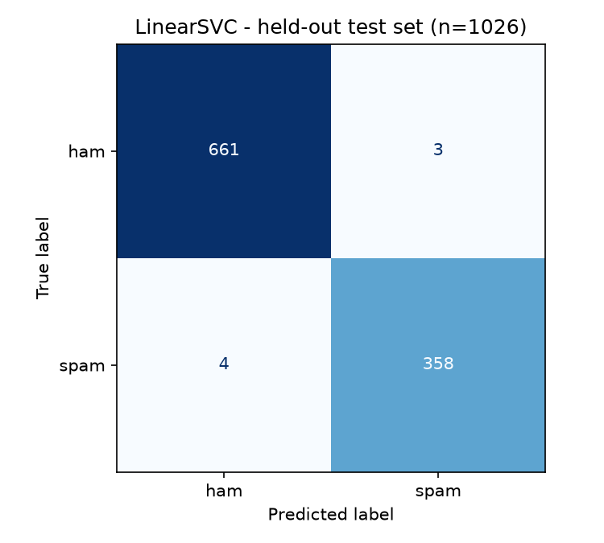
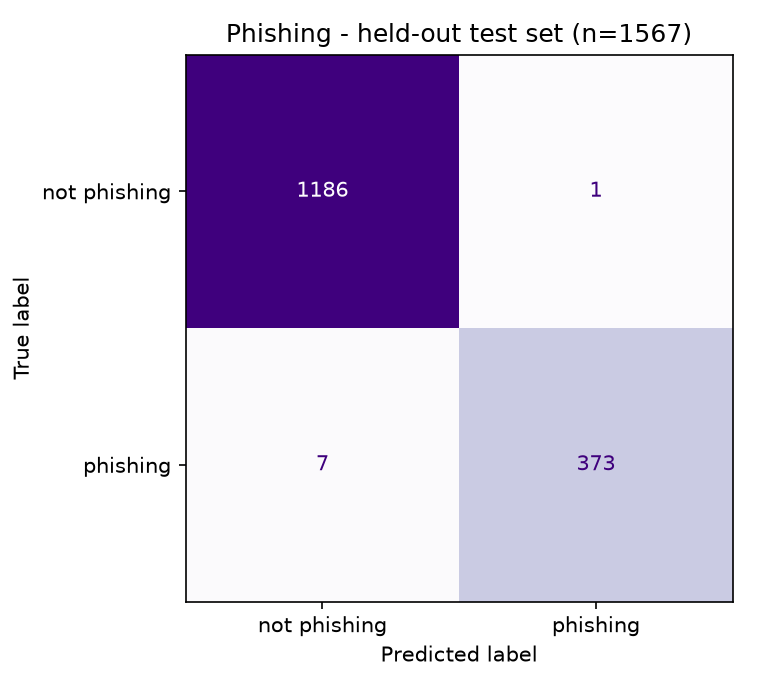

# Email Threat Detection — Machine Learning Module

Two trained classifiers that replace LLM prompts with measurable models:
**spam detection** and **phishing detection**.

The app's **Spam Detection** tool originally worked by sending the email to Mistral with
a prompt asking "is this spam?". That answer cannot be evaluated — there is no ground
truth, no metric, and no way to tell whether a change made it better or worse. This
module trains a classical model on a labelled corpus so the same feature produces a
number you can defend.

---

## Results

Trained on the [SpamAssassin public corpus](https://spamassassin.apache.org/old/publiccorpus/) —
**4,528 real emails** (2,720 ham / 1,808 spam) after de-duplication — plus **600 synthetic
legitimate emails** added to the ham class, 400 business and 200 transactional (see
*Modern work mail* below for why).

| Metric | Held-out test set (n = 1026) | Corpus only |
|---|---|---|
| Accuracy | **0.9932** | 0.9890 |
| Precision (spam) | **0.9917** | 0.9783 |
| Recall (spam) | **0.9890** | 0.9945 |
| F1 | **0.9903** | 0.9863 |
| ROC-AUC | **0.9999** | 0.9988 |

Recall is the one number still below the corpus-only baseline, and it buys a precision rise
more than twice its size: false positives on the corpus fall from 8 to 3. That is the right
direction for a tool that puts a verdict on a user's real mail.

Majority-class baseline is 0.601, so the model is doing real work.

**Model selection** — 5-fold cross-validated F1, computed on the training split only:

| Model | CV F1 |
|---|---|
| MultinomialNB | 0.9713 ± 0.0077 |
| LogisticRegression | 0.9763 ± 0.0053 |
| **LinearSVC** (selected) | **0.9817 ± 0.0028** |



Of 1,026 test emails, **7 are wrong**: 3 false positives and 4 missed spam.

### Modern work mail: the failure the corpus test set could not see

F1 0.986 was true of SpamAssassin and told us nothing about the mail this app actually
reads. Asked to score *"our records show invoice INV-2291 as outstanding, could you check
whether payment was released"*, the model returned **81% spam**.

The cause is visible in the model's own top features. Its most ham-ish tokens were
`2002`, `wrote`, `url http`, `spambayes`, `spamassassin talk`, `razor`, `rpm` — it had not
learned *ham*, it had learned *a Linux mailing list thread from 2002*. Its spam side leaned
on `your`, `our`, `please`, `we`, `business`: the everyday vocabulary of work email. Modern
correspondence carries every spam-leaning token and none of the ham markers.

`eval_workmail.py` measures this directly, on 38 hand-written messages that are never
trained on, in three groups: business mail of the register `work_negatives.py` teaches but
phrased differently, legitimate mail from registers it never covers at all (personal notes,
university, utilities, healthcare), and real junk to guard the other direction.

| | Corpus only | + business ham | + service notices |
|---|---|---|---|
| Business mail, unseen phrasing (n=20) | 7 wrong (35%) | **0 wrong** | **0 wrong** |
| Transactional notices (n=10) | — | 4 wrong (40%) | **0 wrong** |
| Registers nothing generates (n=10) | — | 2 wrong (20%) | **0 wrong** |
| Real spam still caught (n=11) | 11/11 | 11/11 | **11/11** |
| **Ham false-positive rate** | **40%** | 15% | **0%** |
| Corpus F1 | 0.9863 | 0.9889 | **0.9903** |

### The second gap: words that used to mean spam

Business ham fixed work email and left one failure standing — *"Your prescription is
ready for collection at the pharmacy on Mill Road"* at **83.8% spam**. Asking the model
which tokens drove that answers it immediately: `prescription` and `pharmacy`. SpamAssassin
was assembled when pharmaceutical spam was the dominant genre, so in the training data
essentially every mention of a prescription was junk. The model learned the word, not the
intent. The same trap is set for `loan`, `delivery`, `statement` and `account`.

`service_negatives.py` supplies genuine notices that use those words, teaching that context
decides. The pharmacy message now scores **11.6%**, and — the number that matters — pharma
spam is still caught. All three pharma messages in the eval: 96.4%, 94.7% and 83.7%.

That last one is the honest cost — *"Your PHARMACY order is waiting"* sat at 95.5% before,
so the margin narrowed by twelve points. It stays inside the Spam band, and those three
messages are in the eval precisely so the next change to this register has to look at them.

**On the eval itself.** This file first shipped with three groups, and the pharmacy notice
lived in the group labelled *never trained on*. Teaching that register would have quietly
turned an untaught probe into a taught one while the label still said otherwise, so the
groups were restructured in the same change: those messages moved to `SERVICE_NOTICES`, and
a genuinely untaught group was written from registers nothing generates — family, community,
hobbies. That group improved on its own, 2 wrong to 0, without being taught. Reporting a
win on an eval you have since trained against measures memorisation, not generalisation.

The out-of-register group is the one that matters: it improves without having been taught,
so the model generalised past the templates rather than memorising them. The same holds
across seeds — three sets of 400 samples with **zero overlap** train models that score
identically on both the corpus and this set. What carries is the register, not the wording.

**Choosing n.** More synthetic ham is not better. Sweeping the business ham, with service
notices held out:

| n | Corpus F1 | Missed spam | Ham FP |
|---|---|---|---|
| 0 | 0.9863 | 2 | 12/30 |
| 200 | 0.9793 | 7 | 1/30 |
| **400** | **0.9889** | **5** | **1/30** |
| 700 | 0.9875 | 6 | 1/30 |
| 1000 | 0.9889 | 5 | 1/30 |
| 1400 | 0.9833 | 9 | 1/30 |
| 2000 | 0.9806 | 8 | 1/30 |

Past a few hundred the added ham shifts the class prior far enough to cost recall while
buying nothing further. 400 sits at the top of the corpus F1 curve and is the smallest n
that gets there, so it dilutes the real corpus least.

Service notices were swept the same way, with business ham fixed at 400. Less is needed:

| n | Corpus F1 | Recall | Service wrong | Untaught wrong |
|---|---|---|---|---|
| 0 | 0.9889 | 0.9862 | 4/10 | 2/10 |
| **200** | **0.9903** | **0.9890** | **0/10** | **0/10** |
| 400 | 0.9861 | 0.9807 | 0/10 | 0/10 |
| 700 | 0.9875 | 0.9834 | 0/10 | 0/10 |
| 1000 | 0.9833 | 0.9751 | 0/10 | 0/10 |

200 is both the best corpus F1 of any configuration tried and enough to clear the held-out
set completely.

---

## Why not just call the LLM?

| | This model | Mistral prompt |
|---|---|---|
| F1 | **0.986** (measured) | unmeasurable without labels |
| Latency | **0.31 ms** | ~800 ms |
| Cost | **$0** | ~$0.0004 / email |
| Deterministic | **yes** | no |
| Explains in prose | no | **yes** |
| Unseen phrasing | weaker | **stronger** |

Scoring a 10,000-email mailbox: **3.1 seconds and $0.00** locally, versus roughly
**2.2 hours and $4.00** through the API. That is a ~2,600× speedup.

**They are not competitors.** The shipped design runs the classifier on every email and
spends an LLM call only when the model is genuinely uncertain, or when the user wants an
explanation. Fast free verdict from the model; human-readable reasoning from Mistral.

---

## Honest limitations

1. **600 of the 3,320 ham examples are synthetic**, from `work_negatives.py` and
   `service_negatives.py` rather than collected. The held-out set is clean at 0/40, but a
   clean eval is not the same as a solved problem: the model can only have learned the
   registers those two modules represent plus whatever generalises from them, and the
   untaught group is only ten messages. A corpus of real modern mail remains the honest
   fix; this is the closest substitute available offline. Same remedy and same caveat as
   `hard_negatives.py` on the phishing side.

   One measurement lesson worth keeping. An earlier configuration and the shipped one both
   left exactly one of thirty ham messages wrong, so the sweep saw them as equivalent — but
   one scored it 73% (Suspicious) and the other 84% (Spam). Counting failures says nothing
   about how bad each one is, and n was being chosen on counts.
2. **`hard_ham` accuracy is 0.962**, up from 0.877 once the business ham was added. The corpus includes a folder of genuine opt-in
   marketing mail, and that is where nearly every false positive lands — a Netscape 7.0
   release announcement, a Matrox product email, a Word-A-Day newsletter. They share
   vocabulary with spam (`click here`, `free`, `unsubscribe`, heavy HTML), and
   bag-of-words has almost nothing left to separate them.
3. **Corpus artifacts inflate the score.** `spamassassin` and `sightings` rank as strong
   spam indicators, which is an artifact of how this corpus was assembled rather than a
   real signal. True production accuracy would be somewhat lower.
4. **The real data is from 2002–2005.** Spam has changed considerably; this needs retraining
   on recent mail to stay honest.
5. **Text only.** No sender reputation, no SPF/DKIM headers, no user-interaction history —
   exactly the signals that would fix limitation 1.

### Threshold choice

The two error types are not equally costly. Spam reaching the inbox is an annoyance; a
real email silently marked as spam could be a missed job offer. Measured trade-off:

| Threshold | False positives | Missed spam |
|---|---|---|
| 0.5 (default) | 8 | 2 |
| 0.8 | 4 | 16 |
| 0.9 | 2 | 25 |

The API uses a three-band scheme rather than a hard cut — `≥0.80` Spam, `0.45–0.80`
Suspicious, `<0.45` Not spam — so the uncertain middle is where the LLM explanation earns
its latency.

---

## What the model learned

Because the classifier is linear, its coefficients are directly readable — a property the
LLM version does not have.

- **Toward spam:** `click here`, `free`, `remove`, `our`, `your`, and `nbsp` — the HTML
  entity, because spam is overwhelmingly HTML-formatted.
- **Toward ham:** `re`, `wrote`, `url http` — the fingerprints of a genuine reply thread.

---

# Phishing Detection

A separate model, because phishing is a different question. Spam is mail you did not
want; phishing is an active attempt to steal your credentials or your money. A detector
that shouts "phishing!" at every marketing email is worse than useless — it trains people
to ignore the warning.

**Data.** Positives are [Jose Nazario's phishing corpus](https://monkey.org/~jose/phishing/)
(2,706 real phishing emails collected in the wild, 1,901 after de-duplication). Negatives
are the SpamAssassin folders — and crucially that includes **ordinary spam**, not just
clean mail. Putting junk on the negative side is what forces the model to learn
"unwanted" ≠ "attacking you".

| | Count |
|---|---|
| Phishing | 1,901 |
| Legitimate (ham + hard_ham) | 2,720 |
| Ordinary spam | 1,812 |
| Legitimate security mail (synthetic — see below) | 1,400 |
| **Total** | **7,833** |

## Results

| Metric | Held-out test (n = 1,567) |
|---|---|
| Accuracy | **0.9949** |
| Precision | **0.9973** |
| Recall | **0.9816** |
| F1 | **0.9894** |
| ROC-AUC | **0.9992** |



**1 false alarm in 1,187** non-phishing emails; 7 of 380 phishing emails missed. The model
is tuned to be reluctant to accuse, which is the right bias here.

### The metric that actually matters

Overall accuracy would look fine even if the model flagged every spam email as an attack.
So the real test is the false-alarm rate broken down by what kind of mail it was:

| Source | n | Flagged as phishing |
|---|---|---|
| Legitimate mail (`ham`) | 457 | **0.0000** |
| Opt-in marketing (`hard_ham`) | 50 | **0.0000** |
| Legitimate security mail | 298 | **0.0000** |
| Ordinary spam | 382 | **0.0026** (1 email) |
| Phishing (recall) | 380 | **0.9816** caught |

One spam email out of 382 was misread as phishing. The separation between "junk" and
"attack" holds.

## The failure that shaped this model

The first version confidently flagged this **entirely legitimate** IT email as phishing at
83% confidence:

> As part of our quarterly security review, the IT team is asking all employees to review
> their account security settings before Friday. Please open the company portal through
> your usual bookmarked link… **You do not need to send your password or any verification
> codes to the IT team.**

The reason was in the training data, not the algorithm. Measuring how often each term
appears in each class of the original corpus:

| Term | in phishing | in legitimate | ratio |
|---|---|---|---|
| `verify` | 32.5% | 1.3% | **25×** |
| `password` | 21.6% | 1.2% | **17×** |
| `confirm` | 30.0% | 2.5% | **12×** |
| `account` | 79.9% | 7.6% | **11×** |
| `two-factor` | 0.0% | 0.0% | never seen |

The negative class was 2002-era mailing lists and newsletters. It contained essentially
**no ordinary corporate security email**, so every message in training that discussed
accounts and passwords was an attack. The model learned "security vocabulary ⇒ phishing" —
a perfectly rational conclusion from the data it was shown.

Worse, the email's strongest legitimacy signal — *"You do not need to send your password"* —
is invisible to bag-of-words. Unigrams and bigrams cannot represent negation; the phrase
just contributes another count of `password`.

**The fix** was data, not modelling: [`hard_negatives.py`](hard_negatives.py) generates
1,400 legitimate security emails — IT reviews, 2FA rollouts, sign-in alerts, policy
updates, bank card notices, breach disclosures, receipts — built combinatorially from
independent slots so the model learns the *register* rather than memorising sentences.
[`email_features.py`](email_features.py) also gained three legitimacy features
(`n_reassurance`, `has_safe_route`, `has_no_action_needed`) that capture what real security
mail says and phishing never does: *don't share your password*, *use your own bookmark*,
*no action needed*.

Result on that email: **83% phishing → 0.3%**, and every metric above improved rather than
trading off.

## A negative result: the engineered features did not help

The interesting part of this model is a hypothesis that **failed**.

Phishing has obvious structural tells that bag-of-words should miss, so
[`email_features.py`](email_features.py) implements 21 hand-engineered signals — URL
count, IP-address URLs, `@`-in-URL obfuscation, hex-encoded hosts, free/abused TLDs, URL
shorteners, urgency and credential and threat vocabulary, generic greetings
("Dear Customer"), brand-name-vs-link-domain mismatch, caps ratio, embedded password
fields. Three representations were compared by 5-fold CV on the training split:

| Representation | CV F1 |
|---|---|
| **TF-IDF only** (selected) | **0.9811 ± 0.0029** |
| TF-IDF + engineered | 0.9731 ± 0.0050 |
| Engineered only | 0.8375 ± 0.0181 |

Adding the engineered features **cost 0.008 F1**. TF-IDF alone won, so that is what ships.

This is not because the features are meaningless — on their own, those 21 numbers reach
0.84 F1, and their coefficients in the combined model rank exactly as domain knowledge
predicts:

| Feature | Coefficient |
|---|---|
| `n_threat` ("suspended", "unauthorized", "locked") | +0.207 |
| `max_url_len` | +0.170 |
| `n_brands` (PayPal, eBay, banks…) | +0.135 |
| `n_credential` ("password", "verify your account") | +0.117 |
| `has_generic_greeting` ("Dear Customer") | +0.042 |

The problem is **redundancy**, and the notebook measures it rather than asserting it.
Probing the fitted TF-IDF vocabulary for the engineered lexicon:

```
Already in the TF-IDF vocabulary:
  YES  suspended        YES  paypal
  YES  unauthorized     YES  click here
  no   verify your...   YES  dear customer
  YES  password         YES  credit card

7/8 of the engineered lexicon is already a TF-IDF feature.
```

Nearly every engineered signal is *lexical*: `n_threat` counts words like "suspended",
`n_credential` counts "password", `n_brands` counts "paypal" — and a 50,000-feature TF-IDF
over 1–2 grams already holds those exact strings. The engineered block adds 21 dense,
scaled columns that restate what the sparse features encode, and the extra parameters cost
more in variance than they return in signal.

**The general lesson:** feature engineering pays when it supplies information the
representation *cannot reach*. Counting words that are already tokens is not that.

**What would actually help** is the signal deliberately left out: message headers.
Reply-To/From mismatch, SPF and DKIM results, sender domain age, and whether the user has
corresponded with the sender before are not recoverable from body text at any n-gram size.
Those were excluded on purpose — see below.

## Train/serve skew: why headers are excluded

Every feature in `email_features.py` is computable from the email **text alone**.

Header-derived features would very likely improve offline metrics. But the API receives
whatever the user pasted into the box, which is almost always a body with no headers.
Training on signals that are absent at inference time inflates the reported score and then
degrades silently in production — the model leans on a feature that is always zero when it
actually matters. So the honest ceiling for this design is text-only, and the header work
belongs with a real Gmail-API integration that can supply them at request time.

The same module is imported by both `train_phishing.py` and the backend, so training and
serving cannot drift apart.

## Serving

| Endpoint | Purpose |
|---|---|
| `POST /api/v1/ai/classify/phishing` | Pure ML verdict — no LLM, no network |
| `POST /api/v1/ai/tool` (`phishing_detection`) | LLM prose **plus** an `ml` block |

```json
{
  "available": true,
  "verdict": "Phishing",
  "is_phishing": true,
  "confidence": 100.0,
  "phishing_probability": 100.0,
  "signals": ["paypal", "account", "your account", "customer", "security"],
  "latency_ms": 0.89,
  "model": "TF-IDF + LinearSVC (Nazario phishing + SpamAssassin)"
}
```

Verdict bands are deliberately asymmetric — `≥0.80` Phishing, `0.45–0.80` Suspicious,
`<0.45` Safe — so a confident accusation is rare and the uncertain middle is where the LLM
explanation earns its latency.

## Phishing limitations

1. **The legitimate-security examples are synthetic.** They are generated from templates,
   not collected from real inboxes, so the model learns the styles those templates cover.
   Measured on legitimate emails written *after* the templates and deliberately in
   uncovered styles, it gets **6 of 7** right — a bank card-replacement notice, a breach
   disclosure, a GitHub 2FA alert, an AWS root sign-in alert, a university VPN notice and
   an HR benefits email all pass; an insurance renewal still lands in *Suspicious* at 67%.
   That is the honest generalisation figure, and it is lower than the held-out score
   because the held-out synthetic emails share the generator's DNA. Replacing this with
   real modern mail is the single biggest available improvement.
2. **Text-only by design** (below). Headers are the biggest available win.
3. **The corpus is 2004–2007.** Modern phishing uses cloud-hosted landing pages, OAuth
   consent abuse and much cleaner copy than the era this model learned from.
4. **Recall is 0.982** — roughly 1 in 54 phishing emails slips through. Acceptable only
   because this is one layer, not the whole defence.
5. **English only.**
6. **Negative class is 2002-era spam**, which is stylistically very different from modern
   marketing mail, so the spam-vs-phishing separation is likely easier here than in reality.

**No classifier is 100% accurate**, and one claiming to be has almost certainly been
evaluated on its own training data. The numbers above come from a split touched exactly
once, and the failure modes are listed rather than hidden.


---

## Layout

```
ml/
├── prepare_data.py                  SpamAssassin -> data/emails.csv
├── prepare_phishing.py              Nazario mbox + SpamAssassin -> data/phishing.csv
├── hard_negatives.py                synthetic legitimate security mail -> data/hard_negatives.csv
├── work_negatives.py                synthetic ordinary business mail -> data/work_negatives.csv
├── service_negatives.py             synthetic legitimate service notices -> data/service_negatives.csv
├── eval_workmail.py                 held-out check: does it leave modern mail alone?
├── train.py                         spam: benchmark 3 models, evaluate, save
├── train_phishing.py                phishing: benchmark 3 representations, evaluate, save
├── email_features.py                21 engineered features, SHARED by training + backend
├── requirements.txt                 training-only deps
├── notebooks/
│   ├── spam_classifier.ipynb        EDA, model selection, error analysis
│   └── phishing_classifier.ipynb    the failed feature-engineering experiment
├── data/
│   ├── raw/                         downloaded corpora (gitignored)
│   ├── emails.csv                   parsed spam dataset (gitignored)
│   ├── phishing.csv                 parsed phishing dataset (gitignored)
│   └── hard_negatives.csv           generated legitimate security mail (gitignored)
└── models/
    ├── spam_clf.joblib              Pipeline(TF-IDF -> LinearSVC)
    ├── metrics.json
    ├── confusion_matrix.png
    ├── phishing_clf.joblib          Pipeline(TF-IDF -> LinearSVC)
    ├── phishing_metrics.json
    ├── phishing_confusion_matrix.png
    └── phishing_feature_importance.png
```

`email_features.py` is imported by `train_phishing.py` **and** by
`backend/app/services/ml_service.py`. The fitted pipeline pickles a reference to
`email_features.PhishingFeatures`, so the module must be importable under that name in
both processes — and sharing one copy is what guarantees training and serving compute
features identically.

## Reproducing

```bash
# 1. download the corpus
mkdir -p ml/data/raw && cd ml/data/raw
for f in 20030228_easy_ham 20030228_hard_ham 20030228_spam 20050311_spam_2; do
  curl -sSLO "https://spamassassin.apache.org/old/publiccorpus/$f.tar.bz2"
  tar -xjf "$f.tar.bz2"
done
cd ../../..

# 2. download the phishing corpus
mkdir -p ml/data/raw/phishing && cd ml/data/raw/phishing
for f in 20051114 phishing0 phishing1 phishing2 phishing3 private-phishing4; do
  curl -sSLO "https://monkey.org/~jose/phishing/$f.mbox"
done
cd ../../../..

# 3. install training deps
pip install -r ml/requirements.txt

# 4. spam:     parse -> augment -> train -> evaluate  (~45s)
python ml/prepare_data.py
python ml/work_negatives.py
python ml/service_negatives.py
python ml/train.py
python ml/eval_workmail.py       # held-out modern mail, not part of training

# 5. phishing: parse -> augment -> train -> evaluate  (~4min)
python ml/prepare_phishing.py
python ml/hard_negatives.py
python ml/train_phishing.py
```

Both training scripts are seeded (`random_state=42`), so the numbers above reproduce
exactly **given the same input files**.

> **Two reproducibility notes.**
> The figures on this page were produced from four of the six phishing archives —
> `phishing3.mbox` and `private-phishing4.mbox` are repeatedly quarantined by Windows
> Defender, since they are archives of genuinely malicious mail. Including them yields a
> larger positive class and slightly different numbers. Whitelist the folder first if you
> want the full corpus.
> `prepare_phishing.py` deliberately does not use `mailbox.mbox`: that opens the file
> `'rb+'`, which fails with EINVAL when a scanner holds a handle on it. It splits on the
> mbox `From ` separator with read-only access instead.

## Pipeline design

**TF-IDF**, word 1–2 grams, 50k features max:

- `ngram_range=(1,2)` — bigrams capture `"click here"` and `"act now"`, which unigrams miss.
- `sublinear_tf=True` — `1 + log(tf)` instead of raw counts. Spam repeats words heavily;
  without this one word repeated 50× dominates the vector.
- `min_df=2` — drops single-occurrence terms, mostly hashes and message IDs the model
  would otherwise use to memorise individual emails.
- `max_df=0.9` — drops near-universal terms.

**LinearSVC** wrapped in `CalibratedClassifierCV`, because a raw SVM decision function is
not a probability and the API returns a confidence score.

---

## Serving

`backend/app/services/ml_service.py` lazy-loads the pipeline on first request and degrades
gracefully to `available: False` when the model file is absent, so a fresh clone still
runs before anyone has trained anything.

| Endpoint | Purpose |
|---|---|
| `POST /api/v1/ai/classify/spam` | Pure ML verdict — no LLM, no network |
| `GET /api/v1/ai/classify/health` | Model status + stored evaluation metrics |
| `POST /api/v1/ai/tool` (`spam_detection`) | LLM prose **plus** an `ml` block |

```bash
curl -X POST http://localhost:8000/api/v1/ai/classify/spam \
  -H "Content-Type: application/json" \
  -d '{"text":"URGENT! You have WON $1000000. Click here to claim your FREE prize."}'
```

```json
{
  "available": true,
  "verdict": "Spam",
  "is_spam": true,
  "confidence": 100.0,
  "spam_probability": 100.0,
  "signals": ["click here", "our", "free", "your", "click", "offer"],
  "latency_ms": 0.31,
  "model": "TF-IDF + LinearSVC (SpamAssassin corpus)"
}
```

`signals` are computed per-request by multiplying each term's TF-IDF weight by its model
coefficient, so they explain **this** email's score rather than listing global feature
importance.

## Next steps

- **Header-derived features** (SPF/DKIM, sender domain age, Reply-To mismatch, prior
  correspondence) — the single biggest available win for both models. It fixes the spam
  model's `hard_ham` weakness and is the one signal class the phishing model provably
  cannot recover from text. Requires wiring the Gmail API into the request path so the
  headers exist at inference time.
- Calibrate thresholds against an explicit false-positive budget instead of maximising F1.
- Re-evaluate on a modern corpus; consider a fine-tuned transformer as a benchmark ceiling.
- `tone_detection` is the remaining LLM-only classifier, though it lacks an obvious
  labelled corpus and is a genuinely better fit for an LLM than the other two.
